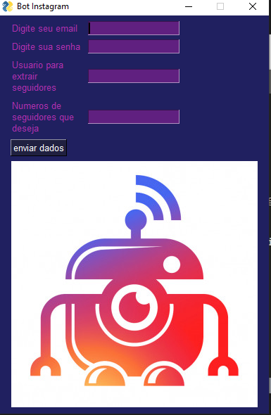

Bot para seguir pessoas a partir de um usuário

Para usar voce precisa colocar alguns parametros:

email: seu email ou nome de usuario

senha: sua senha

usuario: nome do usuario quem o bot vai procurar os seguidores.

numero: numeros de seguidores que o bot irá seguir

# Atencão: não remova o executavel da pasta senão não irá fucionar.

  

